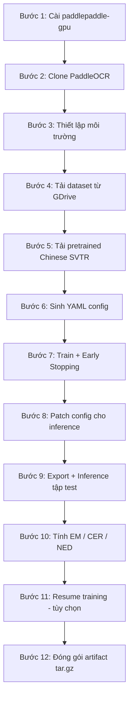
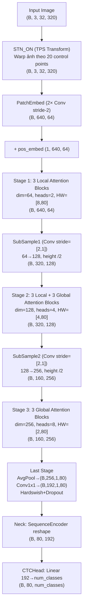

# Luồng huấn luyện SVTR Tiny cho OCR tiếng Nhật

> Tài liệu mô tả chi tiết pipeline huấn luyện mô hình **SVTR Tiny** (Scene Vision Transformer for Text Recognition) trên dữ liệu dòng văn bản tiếng Nhật, dựa trên notebook `final_train_svtr.py`.

---

## 1. Tổng quan Pipeline

Pipeline gồm 12 bước, chạy trên Runpod (RTX 3090 24GB VRAM):




### Mô tả ngắn từng bước


| Bước | Mục đích                                                                 |
| ---- | ------------------------------------------------------------------------ |
| 1    | Gỡ PyTorch xung đột, cài `paddlepaddle-gpu==3.0.0` (CUDA 12.6)           |
| 2    | Clone PaddleOCR repo, cài dependencies                                   |
| 3    | Khai báo seed, đường dẫn workspace, image shape `3×32×320`               |
| 4    | Tải `line_dataset_60k.tar.gz` từ Google Drive, giải nén                  |
| 5    | Tải pretrained `rec_svtr_tiny_none_ctc_ch_train` (Chinese SVTR Tiny CTC) |
| 6    | Sinh file `svtr_tiny_line.yml` — lấy Architecture từ pretrained YAML, override `out_char_num=80` |
| 7    | Chạy `tools/train.py` với early stopping (patience = 16 × eval_step)     |
| 8    | Đổi `RecResizeImg` → `SVTRRecResizeImg` cho inference SVTR               |
| 9    | Export inference model, chạy predict trên tập test                       |
| 10   | Tính Exact Match, CER, NED trên kết quả predict                          |
| 11   | (Tùy chọn) Resume training từ checkpoint `latest`                        |
| 12   | Đóng gói 2 bản: deploy (infer-only) và resume (tiếp train)               |


---

## 2. Kiến trúc mô hình — Chi tiết từng module và shape

### 2.1 Sơ đồ tổng thể




### 2.2 STN_ON — Spatial Transformer Network

**Mục đích:** Rectification — nắn chỉnh hình học ảnh đầu vào trước khi đưa qua backbone, giúp xử lý text cong/nghiêng.

**Cấu hình:**

- `tps_inputsize`: `[32, 64]` — ảnh được resize nhỏ để predict control points
- `tps_outputsize`: `[32, 320]` — kích thước output sau warp (giữ nguyên input size)
- `num_control_points`: 20 (10 trên + 10 dưới)
- `tps_margins`: `[0.05, 0.05]`
- `stn_activation`: `none`

**Luồng xử lý:**

```
Input (B, 3, 32, 320)
    │
    ├──→ Interpolate → (B, 3, 32, 64)  [STN input nhỏ]
    │         │
    │         ▼
    │    STN ConvNet (6 conv3x3+BN+ReLU + MaxPool)
    │    → flatten → FC1(512) → FC2(40) → reshape (B, 20, 2)
    │         │
    │         ▼ [20 control points]
    │
    └──→ TPS Spatial Transformer (warp theo control points)
              │
              ▼
         Output (B, 3, 32, 320)  [ảnh đã nắn thẳng]
```

STN ConvNet gồm 6 lớp conv3×3 với MaxPool2D xen kẽ, giảm spatial từ `32×64` xuống `1×2`, flatten ra `512` features, rồi predict `20×2 = 40` tọa độ control points.

### 2.3 PatchEmbed — Chuyển ảnh thành chuỗi token

**Cấu hình:** `sub_num=2`, `embed_dim[0]=64`

Gồm 2 lớp `ConvBNLayer` stride-2:

1. Conv2D `3→32`, kernel 3×3, stride 2, padding 1 → `(B, 32, 16, 160)` + BN + GELU
2. Conv2D `32→64`, kernel 3×3, stride 2, padding 1 → `(B, 64, 8, 80)` + BN + GELU

Sau đó flatten spatial và transpose:

```
(B, 64, 8, 80) → flatten(2) → (B, 64, 640) → transpose → (B, 640, 64)
```

**Ý nghĩa:** Mỗi token đại diện cho một patch `4×4` pixel trên ảnh gốc (do 2 lần stride-2). Tổng cộng `8×80 = 640` token, mỗi token có chiều `64`.

### 2.4 Positional Embedding

```
pos_embed: learnable parameter (1, 640, 64)
x = patch_tokens + pos_embed  → (B, 640, 64)
```

Cung cấp thông tin vị trí cho từng token trong chuỗi.

### 2.5 Stage 1 — Local Attention (3 blocks)


| Tham số   | Giá trị           |
| --------- | ----------------- |
| Số blocks | 3                 |
| dim       | 64                |
| num_heads | 2 (head_dim = 32) |
| mixer     | Local ×3          |
| local_k   | [7, 11]           |
| HW        | [8, 80]           |
| mlp_ratio | 4 (hidden = 256)  |
| prenorm   | False             |


**Phân bổ mixer:** `mixer[0:3]` = `[Local, Local, Local]` — toàn bộ 3 blocks dùng Local Attention.

**Local Attention:** Mỗi token chỉ attend trong cửa sổ `7×11` xung quanh nó (7 theo chiều cao, 11 theo chiều rộng). Dùng attention mask để block các vị trí ngoài cửa sổ → giảm complexity từ O(N²) xuống O(N × k).

**Block structure (prenorm=False):**

```
x = x + DropPath(Attention(LayerNorm(x)))
x = x + DropPath(MLP(LayerNorm(x)))
```

**Output:** `(B, 640, 64)` — giữ nguyên shape.

### 2.6 SubSample1 — Merging stage 1→2

**Loại:** Conv (stride=[2, 1])

```
Input: (B, 640, 64)
  → transpose+reshape → (B, 64, 8, 80)
  → Conv2D(64→128, k=3, stride=[2,1], pad=1) → (B, 128, 4, 80)
  → flatten+transpose → (B, 320, 128)
  → LayerNorm(128)
Output: (B, 320, 128)
```

**Ý nghĩa:** Giảm chiều cao `/2` (8→4), giữ nguyên chiều rộng (80). Tăng channels `64→128`. Token từ `640` giảm còn `320`.

### 2.7 Stage 2 — Local + Global Attention (6 blocks)


| Tham số   | Giá trị                |
| --------- | ---------------------- |
| Số blocks | 6 (3 Local + 3 Global) |
| dim       | 128                    |
| num_heads | 4 (head_dim = 32)      |
| mixer     | Local ×3, Global ×3    |
| local_k   | [7, 11]                |
| HW        | [4, 80]                |
| mlp_ratio | 4 (hidden = 512)       |


**Phân bổ mixer:** `mixer[3:9]` = `[Local, Local, Local, Global, Global, Global]`

Stage dài nhất — 6 blocks trên không gian `4×80`:

- **3 blocks đầu (Local):** attend cửa sổ `7×11` (do height chỉ còn 4, thực tế attend toàn bộ chiều cao tại mỗi vị trí, giới hạn 11 theo chiều rộng)
- **3 blocks sau (Global):** full self-attention trên toàn bộ 320 tokens — bắt đầu capture ngữ cảnh dài

**Output:** `(B, 320, 128)`

### 2.8 SubSample2 — Merging stage 2→3

```
Input: (B, 320, 128)
  → transpose+reshape → (B, 128, 4, 80)
  → Conv2D(128→256, k=3, stride=[2,1], pad=1) → (B, 256, 2, 80)
  → flatten+transpose → (B, 160, 256)
  → LayerNorm(256)
Output: (B, 160, 256)
```

Height giảm từ `4→2`, channels tăng `128→256`. Tokens: `320→160`.

### 2.9 Stage 3 — Global Attention (3 blocks)


| Tham số   | Giá trị           |
| --------- | ----------------- |
| Số blocks | 3                 |
| dim       | 256               |
| num_heads | 8 (head_dim = 32) |
| mixer     | Global ×3         |
| HW        | [2, 80]           |
| mlp_ratio | 4 (hidden = 1024) |


**Phân bổ mixer:** `mixer[9:12]` = `[Global, Global, Global]`

**Global Attention:** Mỗi token attend **tất cả** 160 token còn lại — full self-attention. Cho phép mô hình nắm bắt ngữ cảnh toàn cục của toàn bộ dòng text.

**Output:** `(B, 160, 256)`

### 2.10 Last Stage — Projection ra output

```
Input: (B, 160, 256)
  → transpose+reshape → (B, 256, 2, 80)
  → AdaptiveAvgPool2D([1, 80]) → (B, 256, 1, 80)   [out_char_num=80: chỉ pool H, giữ nguyên W]
  → Conv2D(256→192, k=1) → (B, 192, 1, 80)
  → Hardswish activation
  → Dropout(p=0.1)
Output: (B, 192, 1, 80)
```

**Ý nghĩa:** `out_char_num=80` — khớp với `max_text_length=80`, mỗi trong 80 timestep tương ứng một cột đặc trưng. AdaptiveAvgPool chỉ collapse chiều cao (2→1), giữ nguyên chiều rộng 80 — đúng với thiết kế trong bài báo SVTR gốc. `out_channels=192` — chiều embedding cuối cùng cho mỗi vị trí.

### 2.11 Neck — SequenceEncoder (reshape)

```
Input: (B, 192, 1, 80)
  → squeeze dim 2 → (B, 192, 80)
  → transpose → (B, 80, 192)
Output: (B, 80, 192)
```

Đơn giản reshape 2D feature map thành sequence 1D cho CTC head.

### 2.12 Head — CTCHead

```
Input: (B, 80, 192)
  → Linear(192 → num_classes)
Output: (B, 80, num_classes)
```

Trong đó `num_classes = len(dict_japanese.txt) + 1` (thêm 1 token blank cho CTC). Mỗi vị trí trong 80 timestep dự đoán phân phối xác suất trên toàn bộ vocabulary.

### 2.13 Loss — CTCLoss

CTC (Connectionist Temporal Classification) cho phép training mà không cần alignment giữa input frames và output characters. Model predict 80 frames, CTC tự tìm alignment tối ưu với ground truth (tối đa `max_text_length=80` ký tự).

---

## 3. Cấu hình huấn luyện chi tiết

### 3.1 Optimizer


| Tham số       | Giá trị         | Ghi chú                                                     |
| ------------- | --------------- | ----------------------------------------------------------- |
| name          | Adam            | Không dùng AdamW như pretrain gốc                           |
| beta1         | 0.9             |                                                             |
| beta2         | 0.999           |                                                             |
| learning_rate | 8e-4            | Cosine schedule, scale từ 4e-4 (batch 96) lên cho batch 256 |
| warmup_epoch  | 3               | LR tăng dần 3 epoch đầu                                     |
| regularizer   | L2, factor=1e-5 | Weight decay nhẹ                                            |


### 3.2 Dữ liệu


| Tham số            | Giá trị                                 |
| ------------------ | --------------------------------------- |
| Dataset type       | SimpleDataSet (file-based, không LMDB)  |
| Image shape        | 3×32×320                                |
| Train augmentation | RecAug (random distortion, blur, noise) |
| Eval augmentation  | Không có                                |
| max_text_length    | 80                                      |
| use_space_char     | False                                   |
| character_dict     | dict_japanese.txt                       |


### 3.3 Training loop


| Tham số             | Giá trị                        |
| ------------------- | ------------------------------ |
| epoch_num           | 100                            |
| batch_size_per_card | 256                            |
| num_workers         | 12                             |
| drop_last           | True                           |
| eval_batch_step     | [0, max(200, steps_per_epoch)] |
| save_epoch_step     | 5                              |
| Metric chính        | norm_edit_dis (= 1 − NED)      |
| Early stopping      | 16 lần eval không cải thiện    |
| seed                | 42                             |


### 3.4 Chiến lược Early Stopping

```
eval_step = max(200, n_train // batch_size)  ≈ 1 epoch
patience = 16 × eval_step steps ≈ 16 epochs

Mỗi lần eval:
  - Parse "cur metric, norm_edit_dis: X" từ stdout
  - Nếu X > best + 1e-6 → reset counter, cập nhật best
  - Nếu không → counter += 1
  - Nếu counter >= 16 → terminate process (early stop)
```

---

## 4. So sánh với cấu hình Chinese gốc (Pretrained)

### 4.1 Bảng so sánh


| Khía cạnh              | Chinese (pretrain)              | Japanese (fine-tune)  |
| ---------------------- | ------------------------------- | --------------------- |
| **Optimizer**          | AdamW, weight_decay=0.05        | Adam, L2 reg=1e-5     |
| **LR**                 | 3e-4, warmup 5 epochs           | 8e-4, warmup 3 epochs |
| **epsilon**            | 8e-8                            | mặc định (1e-8)       |
| **no_weight_decay**    | norm, pos_embed                 | không áp dụng         |
| **Image shape**        | `3×64×256`                      | `3×32×320`            |
| **Dataset type**       | LMDBDataSet                     | SimpleDataSet         |
| **Batch size (train)** | 128                             | 256                   |
| **Batch size (eval)**  | 256                             | 256                   |
| **num_workers**        | 4 train / 2 eval                | 12 cả hai             |
| **max_text_length**    | 40                              | 80                    |
| **out_char_num**       | 40                              | 80 (override từ pretrained)  |
| **use_space_char**     | True                            | False                 |
| **Metric indicator**   | acc (exact match)               | norm_edit_dis         |
| **Dict**               | ppocr_keys_v1.txt (~6763 chars) | dict_japanese.txt     |
| **Data augmentation**  | Không có RecAug                 | RecAug                |
| **eval_batch_step**    | [0, 2000]                       | [0, 200]              |
| **save_epoch_step**    | 10                              | 5                     |
| **print_batch_step**   | 10                              | 20                    |
| **Early stopping**     | Không có                        | 16 evals patience     |


### 4.2 Kiến trúc — GIỐNG NHAU hoàn toàn

Cả hai config đều dùng **cùng một architecture**:

```yaml
Architecture:
  Transform: STN_ON (tps_inputsize=[32,64], tps_outputsize=[32,320], 20 ctrl points)
  Backbone: SVTRNet (img_size=[32,320], embed_dim=[64,128,256], depth=[3,6,3],
            num_heads=[2,4,8], mixer=[Local×6, Global×6], patch_merging=Conv)
  Neck: SequenceEncoder (reshape)
  Head: CTCHead
```

Điều này cho phép **load pretrained weights trực tiếp** — chỉ cần thay CTCHead (do vocabulary khác nhau) khi fine-tune.

### 4.3 Ảnh hưởng của thay đổi Image Shape


|                 | Chinese `3×64×256`                 | Japanese `3×32×320`              |
| --------------- | ---------------------------------- | -------------------------------- |
| Sau PatchEmbed  | `(B, 16×64, 64)` = `(B, 1024, 64)` | `(B, 8×80, 64)` = `(B, 640, 64)` |
| Stage 1 HW      | [16, 64]                           | [8, 80]                          |
| Sau SubSample1  | [8, 64] → 512 tokens               | [4, 80] → 320 tokens             |
| Sau SubSample2  | [4, 64] → 256 tokens               | [2, 80] → 160 tokens             |
| Last Stage pool | (B, 256, 1, 40)                    | (B, 256, 1, 80)                  |


> **Lưu ý:** Mặc dù config pretrained ghi `img_size=[32,320]` trong Architecture (cho backbone), dataset Chinese thực tế dùng `image_shape=[3,64,256]` trong transforms. Khi fine-tune cho Japanese, image shape resize về `32×320` — khớp đúng với `img_size` backbone khai báo.

---

## 5. Các quyết định thiết kế và lý do

### 5.1 Tại sao dùng `norm_edit_dis` thay vì `acc`?

- **acc** (exact match): chỉ tính đúng khi toàn bộ chuỗi khớp 100% — quá khắt khe cho text dài tiếng Nhật
- **norm_edit_dis** (= 1 − NED): đo mức độ gần đúng, thưởng cho dự đoán "gần đúng" — phù hợp hơn khi text trung bình dài (tiếng Nhật có nhiều kanji phức tạp)
- Metric này liên tục hơn, giúp early stopping nhạy hơn với cải thiện nhỏ

### 5.2 Tại sao image shape `32×320` thay vì `64×256`?

- Dòng text tiếng Nhật thường **rộng hơn cao** (nhiều ký tự ngang)
- Width 320 cho phép giữ detail cho dòng dài mà không cần resize quá mức
- Height 32 đủ để nhận diện kanji/hiragana — giảm computation so với 64
- Khớp đúng với `img_size` khai báo trong backbone pretrained

### 5.3 Tại sao LR cao hơn (8e-4 vs 3e-4)?

- Fine-tune từ pretrained: backbone đã có feature tốt, cần LR đủ lớn để CTCHead (layer mới với vocab khác) hội tụ nhanh
- Batch size lớn hơn (256 vs 128): theo linear scaling rule, LR nên scale tương ứng
- Warmup ngắn hơn (3 vs 5 epoch): không cần warm up lâu khi đã có initialization tốt

### 5.4 Tại sao Adam thay vì AdamW?

- AdamW + weight_decay=0.05 phù hợp train from scratch (regularization mạnh)
- Adam + L2=1e-5 nhẹ hơn, tránh "quên" quá nhanh features pretrained khi fine-tune
- Đơn giản hơn: không cần config `no_weight_decay_name` riêng cho norm/pos_embed

### 5.5 Tại sao `max_text_length=80` và `out_char_num=80`?

- Tiếng Nhật: dòng sách/tài liệu có thể chứa 40-60+ ký tự (đặc biệt khi mix kanji + hiragana + katakana)
- `max_text_length=40` của Chinese sẽ truncate nhiều mẫu dài → mất thông tin
- `out_char_num=80` khớp với `max_text_length=80` — backbone output đủ 80 timestep cho CTC decode
- Ở last stage, `AdaptiveAvgPool2D([1, 80])` chỉ pool chiều H (2→1), giữ nguyên W=80 — đúng với thiết kế trong bài báo SVTR gốc (pool-H-only)
- Pretrained Chinese dùng `out_char_num=40`, nhưng thay đổi này không ảnh hưởng transfer learning vì `AdaptiveAvgPool2D` không có learnable parameters và `Conv2D 1×1` hoạt động per-pixel

### 5.6 Tại sao dùng SimpleDataSet thay vì LMDBDataSet?

- Dữ liệu tự chuẩn bị (không phải benchmark có sẵn LMDB)
- SimpleDataSet đọc trực tiếp từ file ảnh + label txt — dễ debug, dễ thêm/xóa mẫu
- Không cần bước build LMDB riêng (tiết kiệm thời gian setup)

### 5.7 Mixer pattern: 6 Local + 6 Global (phân bổ theo depth)

Tổng 12 blocks với `depth=[3,6,3]`, mixer được slice theo thứ tự:

- **Stage 1 (blocks 0–2):** 3 Local — trích xuất đặc trưng cục bộ (nét, stroke, radical) ở resolution cao nhất
- **Stage 2 (blocks 3–8):** 3 Local + 3 Global — chuyển tiếp từ local sang global, bắt đầu capture quan hệ giữa các ký tự lân cận rồi mở rộng ra toàn bộ sequence
- **Stage 3 (blocks 9–11):** 3 Global — full attention ở resolution thấp nhất (160 tokens), capture ngữ cảnh toàn dòng

Design "local→mixed→global" theo chiều sâu giúp cân bằng efficiency (local ở high-res) với modeling capacity (global ở low-res).

---

## 6. File tham khảo


| File                                                | Vai trò                                          |
| --------------------------------------------------- | ------------------------------------------------ |
| `notebooks/final_train_svtr.py`                     | Script huấn luyện chính (12 bước)                |
| `PaddleOCR/ppocr/modeling/backbones/rec_svtrnet.py` | Source code backbone SVTRNet                     |
| `PaddleOCR/ppocr/modeling/transforms/stn.py`        | Source code STN_ON + TPS transform               |
| `models/svtr_tiny_line/metadata/config.yml`         | Config lúc train (trước patch)                   |
| `models/svtr_tiny_line/metadata/svtr_tiny_line.yml` | Config cuối cùng (sau patch, dùng cho inference) |
| `archives/rec_svtr_tiny_6local_6global_stn_ch.yml`  | Config gốc Chinese pretrained                    |


